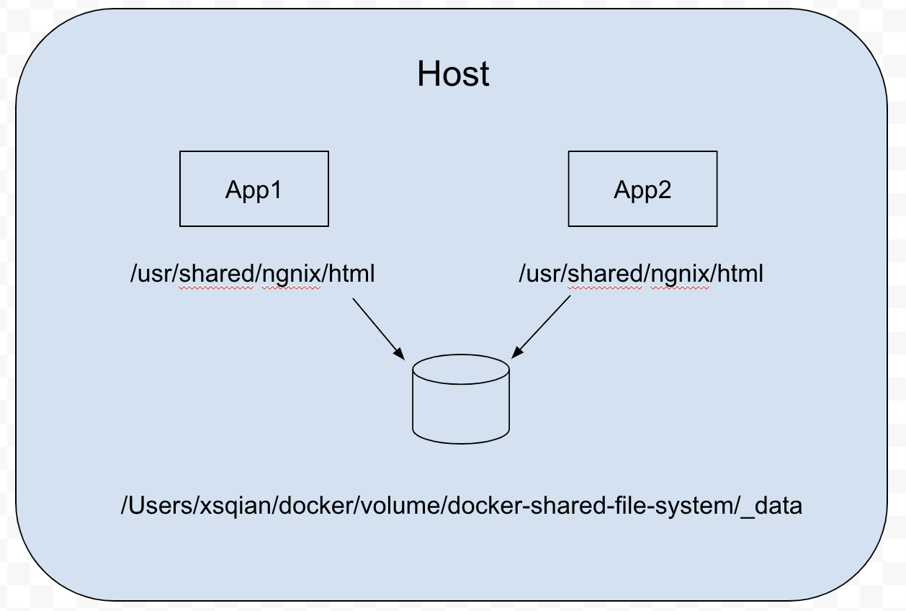

# docker-compose-volume

To show an docker volume creation and used by the 2 docker container in 2 different docker compose

[]()
## Installation

run the volume creation
```
docker volume create --driver local \
 --opt type=none \
 --opt device=/Users/xsqian/docker/volume/docker-shared-file-systeem/_data \
 --opt o=bind web_data
```

## Usage

```
cd app1
docker-compose up -d

cd app2
docker-compose up -d
```
you will have 2 docker containers running connecting to the same volume
